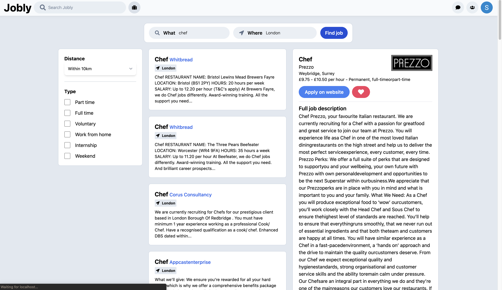
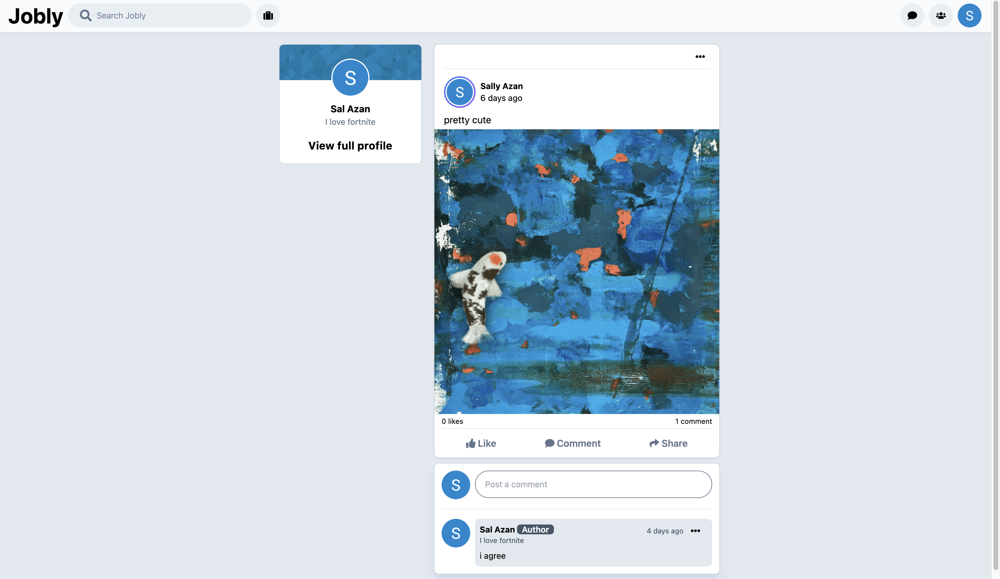
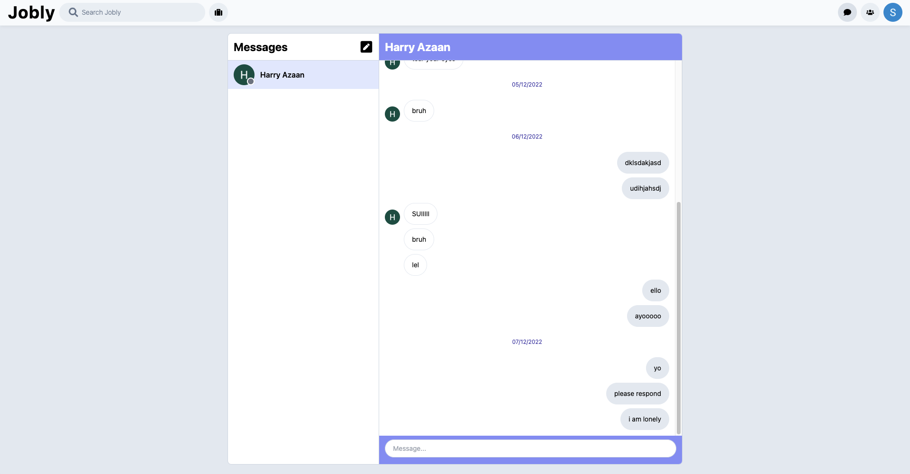

# Jobly - Jobs for you

A job finding site for my NEA project.

## My objectives:

-   Search for jobs
-   Post about stuff
-   Message each other securely through direct messages
    -   Messages will be encrypted on the server
-   Manage a relational database

## My stack (for the frontend):

-   Web Framework - [NextJS](https://nextjs.org/)
-   Language - TypeScript
-   CSS Framework - [Tailwind](https://tailwindcss.com/)
-   Database - MySQL
-   Object Relational Mapper - [Prisma](https://www.prisma.io/)
-   Authentication Manager - [NextAuth](https://next-auth.js.org/)
-   Cloud Storage - [Firebase](https://firebase.google.com/)
-   Web Scraper - [Cheerio](https://cheerio.js.org/)
-   Caching - [React Query](https://react-query-v3.tanstack.com/)
-   Validation - [Zod](https://zod.dev/)
-   WebSockets - [Socket.io](https://socket.io/)

## Screenshots

Searching for jobs

Viewing posts

Direct messages
